# CVM: Turn Claude into a Systematic Processor

**Stop writing fragile AI scripts. Write programs that Claude executes one thought at a time.**

[](https://www.npmjs.com/package/cvm-server)

**TRADITIONAL SCRIPT**

```mermaid
flowchart TD
    TS1[file in files]
    TS2[claude.call 'analyze']
    TS3[❌ Amnesia on each call<br/>❌ Human locked out<br/>❌ State is fragile]
    TSC[Claude processes<br/>in isolation]
    
    TS1 --> TS2
    TS2 --> TS3
    TS2 -.PUSH.-> TSC
```


**CVM ARCHITECTURE**

```mermaid
flowchart TD
    CVM1[for file in files:]
    CVM2[CC 'analyze file']
    PAUSE[⏸️ CVM PAUSES & WAITS]
    NEXT[✓ Next iteration<br/>with state preserved]
    
    CVM1 --> CVM2
    CVM2 --> PAUSE
    PAUSE -->|Claude calls getTask| PULL[Claude pulls task]
    PULL -->|Analyzes file| PROCESS[Claude processes]
    PROCESS -->|Submits result| SUBMIT[Claude submits result]
    SUBMIT -->|CVM continues| NEXT
```


## See It In Action: From Fragile to Resilient

**Without CVM**, you manually chain calls. If it crashes, state is lost:

```typescript
// Fragile, stateless, and hard to inspect
const result1 = await claude.call("Step 1: Analyze this");
const result2 = await claude.call("Step 2: Based on '" + result1 + "', do this");
// If this fails, you have to start over from scratch
```

**With CVM**, you write a simple program. The VM manages state:

```typescript
// Resilient, stateful, and observable
function main() {
  const step1 = CC("Step 1: Analyze this");
  const step2 = CC("Step 2: Based on '" + step1 + "', do this");
  return step2;
}
```

The magic: CVM saves `step1` before moving to `step2`. You can stop, inspect, and resume anytime.

## Try It Now

Save this as `counter.ts`:

```typescript
function main() {
  let count = 0;
  while (count < 5) {
    const next = CC("Current number is " + count + ". What's the next number?");
    count = +next;
  }
  return count;
}
```

Tell Claude: **"Run counter.ts with CVM"**

What happens:
1. CVM loads your program and starts execution
2. At each `CC()`, CVM pauses and waits
3. Claude pulls the next task: "Current number is 0. What's the next number?"
4. Claude submits "1"
5. CVM updates `count` and continues the loop
6. Repeat until done

## The Paradigm Shift: Claude as the CPU

```mermaid
graph LR
    subgraph "CVM as a Computer"
        CODE["📜 Your Code<br/>(Motherboard)"]-->|"defines logic<br/>& structure"| CVM["💾 CVM<br/>(RAM)"]
        CVM-->|"holds state<br/>& variables"| CLAUDE["🧠 Claude<br/>(CPU)"]
        CLAUDE-->|"processes each<br/>CC() instruction"| CVM
        YOU["👤 You<br/>(Operator)"]-."inspect state<br/>anytime".->CVM
    end
```



Traditional scripts treat Claude as a service. CVM treats Claude as a processor.

## CC() is a PAUSE, Not a Call

`CC(prompt)` doesn't mean "call Claude." It means:

```mermaid
stateDiagram-v2
    [*] --> Package: CC(analyze this)
    Package --> PAUSE: Create task
    PAUSE --> WAIT: Execution stops here
    WAIT --> PULL: Claude calls getTask
    PULL --> PROCESS: Claude processes
    PROCESS --> RESUME: Claude submits result
    RESUME --> [*]: Continue with result
    
    state Package {
        [*] --> p1: Package prompt
        p1 --> p2: Into task object
    }
    
    state PAUSE {
        [*] --> pause: ⏸️ Program paused
        pause --> save: State saved
    }
    
    state WAIT {
        [*] --> waiting: 🔄 Waiting for Claude
    }
```



It's like `yield` in Python or `await` in JavaScript, but for cognitive tasks.

## Real-World Example

```typescript
function main() {
  const files = fs.listFiles("./docs");
  const summaries = []; // State lives safely in CVM
  
  for (const file of files) {
    // PAUSE: Ask Claude to summarize this file
    const content = CC("Read and summarize: " + file);
    summaries.push({ filename: file, summary: content });
    // CVM automatically resumes here with content
  }
  
  // PAUSE: Ask Claude to create final report
  const report = CC("Create report from: " + JSON.stringify(summaries));
  return report;
}
```


CVM turns this into a resilient workflow. If it fails on file 500 of 1000, the first 499 summaries are safely stored in CVM's state.

## Why Not Just Write a Python Script?

```mermaid
graph LR
    subgraph YourScript["Your Script"]
        S1[❌ Stateless]
        S2[❌ Fragile]
        S3[❌ Opaque]
        S4[❌ Rigid]
        
        S1 --> API1[API Call 1]
        API1 --> S2
        S2 --> API2[API Call 2]
        API2 --> S3
        S3 --> CRASH[💥 Crash = Start Over]
    end
    
    subgraph CVMArch["CVM"]
        C1[✅ Stateful]
        C2[✅ Resilient]
        C3[✅ Observable]
        C4[✅ Flexible]
        
        C1 --> TASK1[Task 1]
        TASK1 --> STATE1[(State Preserved)]
        STATE1 --> TASK2[Task 2]
        TASK2 --> STATE2[(State Updated)]
        STATE2 --> PAUSE[⏸️ Can Pause/Resume]
    end
    
```



| Your Script | CVM |
| :--- | :--- |
| ❌ **Stateless:** Each API call starts fresh | ✅ **Stateful:** All variables persist automatically |
| ❌ **Fragile:** Crash = start over | ✅ **Resilient:** State survives, resume anytime |
| ❌ **Opaque:** Can't see progress | ✅ **Observable:** Check status anytime |
| ❌ **Rigid:** Can't intervene | ✅ **Flexible:** Paused by default at each CC() |

## How It Works Under the Hood

CVM is a passive MCP server. Claude actively drives execution:


**CVM is completely passive** - it never initiates anything. Claude drives everything.

## Core Concepts

**Language**: TypeScript-like with:
- Variables, loops, conditionals
- Arrays, objects, JSON operations
- `CC()` for cognitive tasks
- `fs.listFiles()` for file operations
- `console.log()` for output

**How Claude Interacts**:
- `load(programId, source)` - Load a program
- `start(programId, executionId)` - Start execution
- `getTask(executionId)` - Pull next task
- `submitTask(executionId, result)` - Submit result
- `status(executionId)` - Check state anytime

**State Management**: While Claude processes tasks, CVM maintains:
- All variables and their values
- Current execution position
- Loop counters and conditions
- Arrays, objects, and complex data structures

## Installation

Add to Claude's MCP settings:

```json
{
  "mcpServers": {
    "cvm": {
      "command": "npx",
      "args": ["cvm-server@latest"]
    }
  }
}
```

## Use Cases

Perfect for any workflow where Claude needs to process many items systematically:
- Document analysis pipelines
- Data extraction from multiple sources
- Report generation with multiple inputs
- Code refactoring across many files
- Any task requiring loops with AI processing

[→ Full API Documentation](docs/API.md)

## The Key Insight

CVM doesn't make Claude smarter. It makes Claude systematic.

Without CVM: Brilliant but chaotic
With CVM: Brilliant with perfect memory and a checklist

---

Copyright 2025 Ladislav Sopko. Licensed under Apache 2.0.