# CVM: Turn Claude into a Systematic Processor

**Stop writing fragile AI scripts. Write programs that Claude executes one thought at a time.**

[](https://www.npmjs.com/package/cvm-server)

**TRADITIONAL SCRIPT**

🔘 Gray = Script Operations

```mermaid
flowchart TD
    Start([Start]) --> Loop{More files?}
    Loop -->|Yes| Call[Call Claude API]
    Call --> Response[Get Response]
    Response --> Lost[❌ Context Lost]
    Lost --> Loop
    Loop -->|No| End([End])
    
    Response -.->|Crash| Restart[Start Over From Beginning]
    
    classDef script fill:#e0e0e0,stroke:#666,color:#000
    
    class Start,Loop,Call,Response,Lost,End,Restart script
```



**CVM ARCHITECTURE**

🟢 Green = CVM Operations | 🔵 Blue = Claude Actions | 🟡 Yellow = Human Control

```mermaid
flowchart TD
    Start([Start]) --> Loop{More files?}
    Loop -->|Yes| CC[CC: analyze file]
    CC --> Pause((⏸️ PAUSE))
    Pause --> Wait[Wait for Claude]
    Wait --> GetTask[Claude: getTask]
    GetTask --> Process[Claude processes]
    Process --> Submit[Claude: submitTask]
    Submit --> Save[✓ State saved]
    Save --> Loop
    Loop -->|No| End([End])
    
    Pause -.->|Can inspect| Status[Check Progress]
    Submit -.->|Crash| Resume[Resume from here]
    
    classDef cvm fill:#d4ffd4,stroke:#090,color:#000
    classDef claude fill:#d4d4ff,stroke:#00d,color:#000
    classDef human fill:#ffffd4,stroke:#990,color:#000
    
    class Start,Loop,CC,Pause,Wait,Save,End cvm
    class GetTask,Process,Submit claude
    class Status,Resume human
```



## See It In Action: From Fragile to Resilient

**Without CVM**, you manually chain calls. If it crashes, state is lost:

```typescript
// Fragile, stateless, and hard to inspect
const result1 = await claude.call("Step 1: Analyze this");
const result2 = await claude.call("Step 2: Based on '" + result1 + "', do this");
// If this fails, you have to start over from scratch
```

**With CVM**, you write a simple program. The VM manages state:

```typescript
// Resilient, stateful, and observable
function main() {
  const step1 = CC("Step 1: Analyze this");
  const step2 = CC("Step 2: Based on '" + step1 + "', do this");
  return step2;
}
```

The magic: CVM saves `step1` before moving to `step2`. You can stop, inspect, and resume anytime.

## Try It Now

Save this as `counter.ts`:

```typescript
function main() {
  var count = 0;
  while (count < 5) {
    var next = CC("Current number is " + count + ". What's the next number?");
    count = +next;
  }
  return count;
}
```

Tell Claude: **"Run counter.ts with CVM"**

What happens:
1. CVM loads your program and starts execution
2. At each `CC()`, CVM pauses and waits
3. Claude pulls the next task: "Current number is 0. What's the next number?"
4. Claude submits "1"
5. CVM updates `count` and continues the loop
6. Repeat until done

## The Paradigm Shift: Claude as the CPU

```mermaid
graph LR
    subgraph "CVM as a Computer"
        CODE["📜 Your Code<br/>(Motherboard)"]-->|"defines logic<br/>& structure"| CVM["💾 CVM<br/>(RAM)"]
        CVM-->|"holds state<br/>& variables"| CLAUDE["🧠 Claude<br/>(CPU)"]
        CLAUDE-->|"processes each<br/>CC() instruction"| CVM
        YOU["👤 You<br/>(Operator)"]-."inspect state<br/>anytime".->CVM
    end
```



Traditional scripts treat Claude as a service. CVM treats Claude as a processor.

## Why CVM is a Game-Changer for Developers

**Unique Architecture Benefits:**
- **Inverted control flow**: Instead of your code calling AI APIs, the VM orchestrates and calls you as the cognitive processor
- **State preservation**: The VM maintains all state across interactions, preventing context loss in long-running tasks
- **Focused cognitive tasks**: Developers only need to handle specific decision points, not manage the entire flow

**Developer Experience:**
- **Simple API**: Just 6 straightforward functions (load, start, getTask, submitTask, status, etc.)
- **TypeScript native**: Write programs in familiar TypeScript syntax
- **Clean separation**: Deterministic logic in code, cognitive tasks delegated to AI
- **MongoDB persistence**: Automatic state management between calls

**Use Cases for Developers:**
- Complex multi-step workflows that need AI reasoning
- Data processing pipelines with intelligent decision points
- Interactive development tools that adapt based on context
- Testing scenarios that require creative input
- Code generation workflows with checkpoints

**What Makes It Special:**
The "GPS analogy" from Claude's docs is perfect - developers write the route, but don't have to worry about getting lost in complex flows. The VM guides execution step-by-step, making it ideal for tasks that would otherwise overwhelm AI context windows.

It's particularly elegant for developers who want to build AI-augmented tools without wrestling with prompt engineering and state management complexities.

## CC() is a PAUSE, Not a Call

`CC(prompt)` doesn't mean "call Claude." It means:

```mermaid
stateDiagram-v2
    [*] --> Package: CC(analyze this)
    Package --> PAUSE: Create task
    PAUSE --> WAIT: Execution stops here
    WAIT --> PULL: Claude calls getTask
    PULL --> PROCESS: Claude processes
    PROCESS --> RESUME: Claude submits result
    RESUME --> [*]: Continue with result
    
    state Package {
        [*] --> p1: Package prompt
        p1 --> p2: Into task object
    }
    
    state PAUSE {
        [*] --> pause: ⏸️ Program paused
        pause --> save: State saved
    }
    
    state WAIT {
        [*] --> waiting: 🔄 Waiting for Claude
    }
```



It's like `yield` in Python or `await` in JavaScript, but for cognitive tasks.

## Real-World Example

```typescript
function main() {
  var files = fs.listFiles("./docs");
  var summaries = []; // State lives safely in CVM
  
  for (var i = 0; i < files.length; i++) {
    var file = files[i];
    // PAUSE: Ask Claude to summarize this file
    var content = CC("Read and summarize: " + file);
    summaries.push({ filename: file, summary: content });
    // CVM automatically resumes here with content
  }
  
  // PAUSE: Ask Claude to create final report
  var report = CC("Create report from: " + JSON.stringify(summaries));
  return report;
}
```



```mermaid
flowchart TD
    START([Start]) --> LIST[fs.listFiles]
    LIST --> INIT[summaries = empty array]
    INIT --> LOOP{For each file}
    
    LOOP -->|Has files| CC1[CC: Read and summarize file]
    CC1 --> PAUSE1[⏸️ CVM Pauses]
    PAUSE1 --> CLAUDE1[Claude pulls task]
    CLAUDE1 --> SUMMARY[Claude returns summary]
    SUMMARY --> SAVE[Push to summaries array]
    SAVE --> LOOP
    
    LOOP -->|No more files| CC2[CC: Create final report]
    CC2 --> PAUSE2[⏸️ CVM Pauses]
    PAUSE2 --> CLAUDE2[Claude creates report]
    CLAUDE2 --> RETURN[Return report]
    RETURN --> END([End])
    
    CRASH{{If crash at file 500}} -.-> STATE[(CVM State:<br/>499 summaries<br/>preserved)]
    STATE -.-> RESUME[Can resume<br/>from file 500]
    
```

CVM turns this into a resilient workflow. If it fails on file 500 of 1000, the first 499 summaries are safely stored in CVM's state.

## Why Not Just Write a Python Script?

```mermaid
graph LR
    subgraph YourScript["Your Script"]
        S1[❌ Stateless]
        S2[❌ Fragile]
        S3[❌ Opaque]
        S4[❌ Rigid]
        
        S1 --> API1[API Call 1]
        API1 --> S2
        S2 --> API2[API Call 2]
        API2 --> S3
        S3 --> CRASH[💥 Crash = Start Over]
    end
    
    subgraph CVMArch["CVM"]
        C1[✅ Stateful]
        C2[✅ Resilient]
        C3[✅ Observable]
        C4[✅ Flexible]
        
        C1 --> TASK1[Task 1]
        TASK1 --> STATE1[(State Preserved)]
        STATE1 --> TASK2[Task 2]
        TASK2 --> STATE2[(State Updated)]
        STATE2 --> PAUSE[⏸️ Can Pause/Resume]
    end
    
```



| Your Script | CVM |
| :--- | :--- |
| ❌ **Stateless:** Each API call starts fresh | ✅ **Stateful:** All variables persist automatically |
| ❌ **Fragile:** Crash = start over | ✅ **Resilient:** State survives, resume anytime |
| ❌ **Opaque:** Can't see progress | ✅ **Observable:** Check status anytime |
| ❌ **Rigid:** Can't intervene | ✅ **Flexible:** Paused by default at each CC() |

## How It Works Under the Hood

CVM is a passive MCP server. Claude actively drives execution:


**CVM is completely passive** - it never initiates anything. Claude drives everything.

### Built on MCP (Model Context Protocol)

The `getTask`/`submitTask` interaction shown above follows Claude's **Model Context Protocol (MCP)**. MCP is a specification for building stateful, resilient tools that Claude can operate. CVM acts as an MCP server, which is what allows Claude to actively drive the execution. You don't need to understand MCP to use CVM, but knowing it's built on this standard helps explain its unique, passive architecture.

## How CVM Works: The Interpreter

You might wonder: "How can a TypeScript `while` loop be paused mid-execution?" The answer is that CVM isn't running your code with Node.js or ts-node. Instead, CVM uses a custom interpreter that:

1. **Parses** your TypeScript-like code into an Abstract Syntax Tree (AST)
2. **Walks** this tree step-by-step, executing each instruction
3. **Pauses** when it encounters `CC()`, saving the complete execution state
4. **Resumes** from the exact same position when Claude submits a result

This is why CVM can pause anywhere - it's not running native JavaScript, but carefully interpreting your code instruction by instruction.

## Language Features & Limitations

Since CVM uses a custom interpreter, it supports a TypeScript-like subset designed for reliability and safety.

### ✅ Supported Features

| Feature | Example |
| :--- | :--- |
| Variables | `var name = "CVM"; var version = 1;` |
| Basic Types | Strings, Numbers, Booleans, `null`, `undefined` |
| Arrays | `[1, 2, 3]`, `items.push(4)`, `items[0]` |
| Objects | `{name: "Claude", age: 2}`, `obj.name` |
| Loops | `for (var i = 0; i < items.length; i++)`, `while (i < 5)` |
| Conditionals | `if (x > 10) { ... } else { ... }` |
| Functions | `function helper(x) { return x * 2; }` |
| Operators | `+`, `-`, `*`, `/`, `===`, `!==`, `&&`, `||` |

### ❌ Not Supported

- `import` / `require` statements
- `async` / `await` (use `CC()` instead)
- Classes and `new` keyword
- `try...catch` blocks (see error handling below)
- Arrow functions `() => {}`
- Spread operator `...`
- Destructuring `const {a, b} = obj`
- Template literals `` `Hello ${name}` ``

### 📦 Built-in Functions

| Function | Description |
| :--- | :--- |
| `CC(prompt: string): string` | Pauses execution for Claude to process a task |
| `console.log(...args)` | Outputs to CVM console |
| `fs.listFiles(path, options?)` | Lists files in directory (sandboxed) |
| `JSON.stringify(obj)` | Converts object to JSON string |
| `JSON.parse(str)` | Parses JSON string to object |

## Security & Sandboxing

CVM runs your code in a secure, isolated environment:

- **No Network Access**: Scripts cannot make HTTP requests or access the internet
- **Filesystem Restrictions**: `fs.listFiles()` is limited to the CVM working directory
- **No System Access**: Cannot execute shell commands or access environment variables
- **Memory Limits**: Scripts are bounded by reasonable memory constraints
- **Execution Timeouts**: Long-running operations are automatically terminated

For additional security, we recommend running CVM in a Docker container when processing sensitive data.

## Practical Usage

### Error Handling Without try...catch

Since CVM doesn't support `try...catch`, you must validate Claude's responses defensively:

```typescript
// ❌ Fragile - assumes Claude returns a number
function fragileCounter() {
  var count = 0;
  while (count < 5) {
    var next = CC("Current number is " + count + ". What's next?");
    count = +next;  // Fails if Claude returns "four" instead of "4"
  }
}

// ✅ Robust - validates the response
function robustCounter() {
  var count = 0;
  while (count < 5) {
    var result = CC("Current number is " + count + ". What's next?");
    var nextNum = parseInt(result, 10);
    
    if (isNaN(nextNum)) {
      console.log("Invalid response: '" + result + "'. Retrying...");
      // Loop continues without incrementing, effectively retrying
    } else {
      count = nextNum;
    }
  }
  return count;
}
```

### Checking Execution Status

You can inspect any running execution using the `status` tool:

```typescript
// Claude can check status at any time:
const status = await cvm.status("exec-123");
console.log(status);
// {
//   "executionId": "exec-123",
//   "status": "PAUSED",
//   "currentTask": "Analyzing file 247 of 1000",
//   "state": {
//     "filesProcessed": 246,
//     "summaries": [...]
//   }
// }
```

This allows you to monitor long-running tasks and verify progress without interrupting execution.

## Quick Reference

**MCP Tools Claude Uses**:
- `load(programId, source)` - Load a program
- `start(programId, executionId)` - Start execution
- `getTask(executionId)` - Pull next task
- `submitTask(executionId, result)` - Submit result
- `status(executionId)` - Check state anytime

**What CVM Maintains**:
- All variables and their values
- Current execution position
- Loop counters and conditions
- Complete program state between pauses

## Installation

Add to Claude's MCP settings:

```json
{
  "mcpServers": {
    "cvm": {
      "command": "npx",
      "args": ["cvm-server@latest"]
    }
  }
}
```

## Use Cases

Perfect for any workflow where Claude needs to process many items systematically:
- Document analysis pipelines
- Data extraction from multiple sources
- Report generation with multiple inputs
- Code refactoring across many files
- Any task requiring loops with AI processing

[→ Full API Documentation](docs/API.md)

## The Key Insight

CVM doesn't make Claude smarter. It makes Claude systematic.

Without CVM: Brilliant but chaotic
With CVM: Brilliant with perfect memory and a checklist

---

Copyright 2025 Ladislav Sopko. Licensed under Apache 2.0.