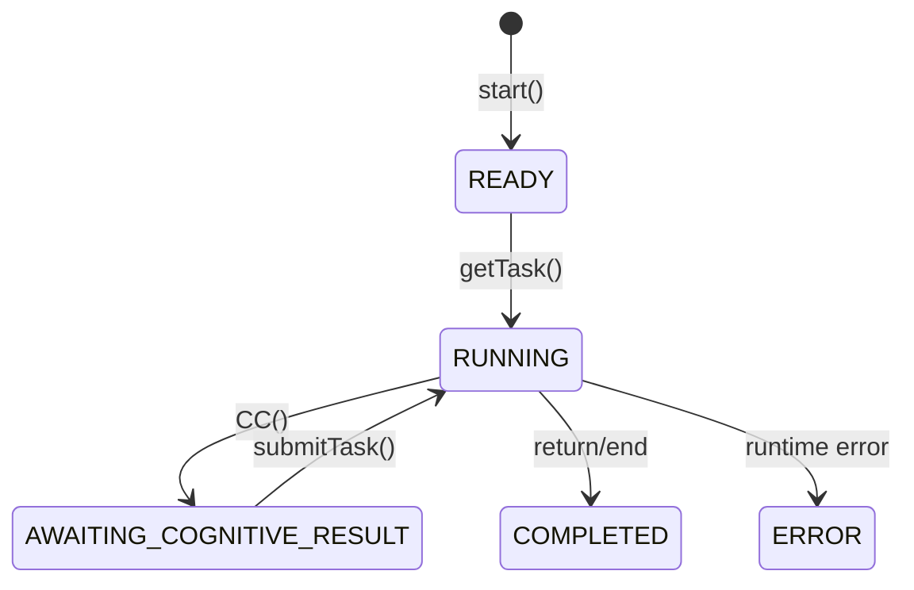

# Implementation Details

## VM Internals

### Bytecode Instructions (Opcodes)

Core opcodes that drive execution:
- **PUSH/POP**: Stack manipulation
- **LOAD/STORE**: Variable access
- **JUMP/JUMP_IF_FALSE**: Control flow
- **CALL/RETURN**: Function calls
- **CC**: Cognitive compute (pause point)
- **PRINT**: Console output
- **BINARY_OP**: Arithmetic/comparison
- **GET/SET**: Object property access

### Stack-Based Execution

The VM uses a stack for all computations:
```typescript
// Expression: 2 + 3
PUSH 2      // Stack: [2]
PUSH 3      // Stack: [2, 3]
BINARY_OP + // Stack: [5]
```

### Variable Storage

Variables stored in Map with proper scoping:
- Global scope for top-level
- Function scope isolation
- No block scoping (simplification)

### Heap Management

Reference types get heap IDs:
```typescript
// Array: [1, 2, 3]
CREATE_ARRAY  // Heap: {1: {type: 'array', elements: []}}
PUSH 1        // Stack: [1]
ARRAY_PUSH    // Heap: {1: {type: 'array', elements: [1]}}
```

## Execution States



## Parser & Compiler

### Parsing Pipeline
1. **Tokenizer**: Source → Tokens
2. **Parser**: Tokens → AST (using Acorn)
3. **Compiler**: AST → Bytecode

### AST Transformations
- Function hoisting
- Implicit main wrapper
- CC call detection
- Validation passes

### Compilation Example
```typescript
// Source
const x = CC("Enter value:");

// AST (simplified)
VariableDeclaration {
  id: "x",
  init: CallExpression {
    callee: "CC",
    arguments: ["Enter value:"]
  }
}

// Bytecode
PUSH "Enter value:"
CC
STORE x
```

## Built-in Functions

### Implementation Pattern
Built-ins are opcodes, not function calls:
- `console.log()` → PRINT opcode
- `array.push()` → ARRAY_PUSH opcode
- `JSON.parse()` → JSON_PARSE opcode

### Available Built-ins
- **I/O**: console.log, CC
- **Type**: typeof, toString
- **Array**: push, length
- **String**: length, substring, indexOf, split, slice
- **JSON**: parse, stringify
- **File**: fs.readFile, fs.writeFile, fs.list

## Memory Model

### Stack Limits
- Max depth prevents overflow
- Validated before each push
- Clear error on violation

### Heap References
- Objects/arrays stored by ID
- Variables hold references
- Enables mutation semantics

### Serialization
Complete state serialized as:
```typescript
{
  pc: number,
  stack: any[],
  variables: Map<string, any>,
  heap: Map<number, HeapObject>,
  status: ExecutionStatus,
  output: string,
  ccPrompt?: string
}
```

## Error Handling

### Runtime Errors
- Stack underflow/overflow
- Invalid opcodes
- Type mismatches
- Undefined variables
- File access violations

### Error Recovery
- Errors set status to ERROR
- State preserved at error point
- Can inspect state for debugging
- Some errors trigger CC() for intervention

## Security & Sandboxing

### File System
- Sandboxed to working directory
- No parent directory access
- Path validation on all operations

### No Network
- No HTTP/fetch capabilities
- No external process execution
- No environment access

### Resource Limits
- Execution timeout
- Memory bounds
- Stack depth limits
- Output buffer size