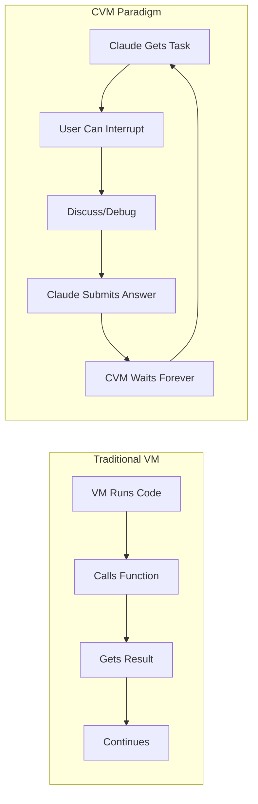
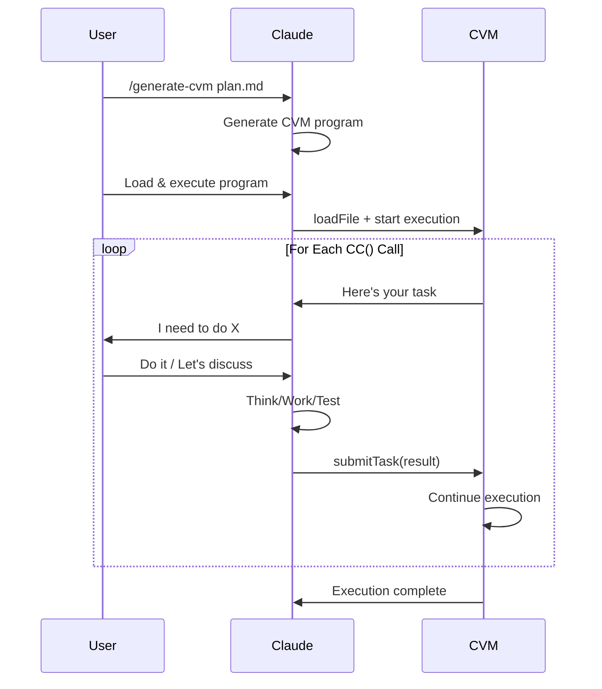
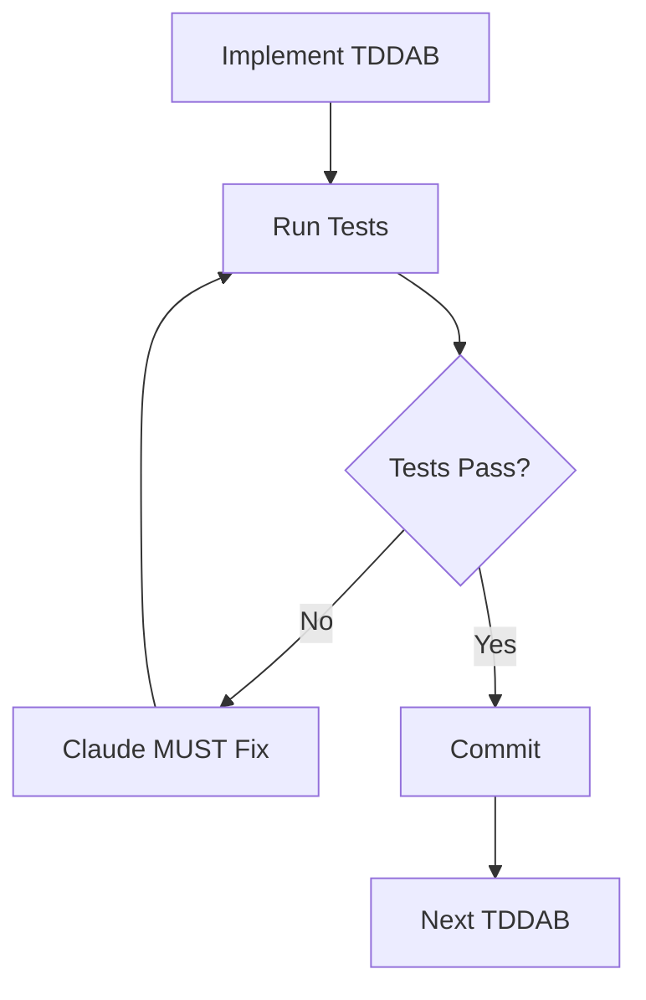

# CVM Paradigm - Full Explanation

**Prerequisites**: You MUST have completed the hands-on demo from `CVM-START-HERE.md` first!

## Now You've Experienced It - Here's What Really Happened



## The Revolutionary Difference

### Traditional Execution
```
Program: "Calculate 2+2"
VM: *calculates* → 4
Done.
```

### CVM Execution
```typescript
function main() {
  const result = CC("What is 2+2?");  // CVM STOPS HERE
  // Waits for Claude...
  // Claude can discuss with user...
  // User can change their mind...
  // Claude submits "4" when ready
  console.log("Answer: " + result);
}
```

## How CVM Actually Works



## Real Example - The Demo Program

```typescript
// /tmp/cvm-demo.ts
function main() {
  let counter = 1;
  
  while (counter < 5) {
    // This CC() call STOPS execution and waits for Claude
    const nextNumber = CC("Current number is " + counter + ". What comes next?");
    console.log("You said: " + nextNumber);
    counter = +nextNumber;
  }
  
  console.log("Counting complete!");
}
```

### What Happens During Execution:

1. **CVM**: "Current number is 1. What comes next?"
2. **Claude**: Thinks... "2"
3. **CVM**: "Current number is 2. What comes next?"
4. **Claude**: "3"
5. **And so on...**

But here's the KEY: Between steps 1 and 2, the user could:
- Ask Claude to explain
- Discuss strategy
- Take a coffee break
- Close the terminal and come back tomorrow!

CVM will wait FOREVER for Claude's response.

## Three Fundamental Rules of CVM Programs

Every CVM program MUST follow these three rules:

### Rule 1: Prompts Must Be Self-Sufficient
Each CC() prompt must contain ALL necessary context. Claude has no memory between CC() calls!

```typescript
// WRONG - assumes Claude remembers
CC("Implement the service");
CC("Now test it");  // What service?

// CORRECT - each prompt is complete
CC("Implement UserService from /plan.md lines 10-30 using pattern X");
CC("Run tests for UserService using mcp__vs-mcp__ExecuteAsyncTest");
```

### Rule 2: Tasks Must Back-Reference the Plan
Every task MUST reference specific line numbers from the source plan:

```typescript
var tddBlocks = [
  {
    name: "TDDAB-1: User Service",
    planReference: "/tasks/plan.md lines 45-67",  // CRITICAL!
    description: "Implement user management"
  }
];

// In prompts:
CC("Implement " + block.name + " as specified in " + block.planReference);
```

### Rule 3: Instructions Must Use Implemented Tools
Only reference tools/commands that Claude actually has access to:

```typescript
// WRONG - assuming tools exist
CC("Use the deploy tool to deploy");

// CORRECT - using actual MCP tools
CC("Use mcp__vs-mcp__ExecuteCommand command='build'");
CC("Use Read, Write, Edit tools for file operations");
```

### Why These Rules Matter

1. **Self-Sufficient Prompts**: CVM is stateless between CC() calls
2. **Plan Back-References**: Ensures traceability and prevents drift
3. **Real Tools Only**: Prevents hallucination of non-existent capabilities

## TDDAB CVM Programs - The Real Power

### Structure of a TDDAB Program

```typescript
function main() {
  // 1. Context and plan reference
  var contextPrompt = "You are implementing X using plan Y...";
  
  // 2. Task definitions with MANDATORY plan references
  var tddBlocks = [
    {
      name: "TDDAB-1: Create Service",
      description: "Implement UserService",
      planReference: "/tasks/plan.md lines 10-50",  // MANDATORY!
      testCommand: "mcp__vs-mcp__ExecuteAsyncTest"
    },
    {
      name: "TDDAB-2: Add Authentication",
      description: "Add JWT auth to UserService",
      planReference: "/tasks/plan.md lines 51-75",  // MANDATORY!
      testCommand: "mcp__vs-mcp__ExecuteAsyncTest"
    }
    // ... more tasks - ALL must have planReference
  ];
  
  // 3. Execution loop
  for (var i = 0; i < tddBlocks.length; i++) {
    // Get implementation
    CC("Implement " + tddBlocks[i].name + "...");
    
    // Test loop - NO ESCAPE!
    var testResult = CC("Run tests...");
    while (testResult === "failed") {
      CC("Fix the failing tests...");
      testResult = CC("Run tests again...");
    }
    
    // Commit
    CC("Commit with message...");
  }
}
```

### The "No Escape" Pattern



## For C# Projects - Critical Rules

### NEVER This:
```bash
dotnet build  # WRONG!
dotnet test   # WRONG!
```

### ALWAYS This:
```typescript
// In CVM program prompts:
"Use mcp__vs-mcp__ExecuteCommand command='build' outputFormat='compact'"
"Use mcp__vs-mcp__ExecuteAsyncTest operation='start' projectName='X'"
"Then mcp__vs-mcp__ExecuteAsyncTest operation='status'"
```

## The `/generate-cvm` Command

When user says: `/generate-cvm SOME_PLAN.md`

You should:
1. Read the plan
2. Generate a CVM program with:
   - Context about the project
   - Array of TDDAB tasks from plan
   - Execution loop with test enforcement
   - Proper tool usage (VS-MCP for C#)
   - Commit after each task

### Template Structure:

```typescript
function main() {
  console.log("=== [Project] Implementation ===");
  
  var contextPrompt = "[Project specific context]";
  var fileOpsBase = contextPrompt + " Use Read, Write, Edit tools...";
  
  var tddBlocks = [
    // Extract from plan
  ];
  
  // Execute each TDDAB
  for (var i = 0; i < tddBlocks.length; i++) {
    // Implementation
    CC(/* prompt with context + task */);
    
    // Test until pass
    var passed = false;
    while (!passed) {
      var result = CC(/* test prompt */);
      passed = (result === "passed");
    }
    
    // Commit
    CC(/* commit prompt */);
  }
}
```

## Key Insights

1. **YOU (Claude) are in control** - CVM waits for you
2. **Interactive at every step** - User can interrupt and discuss
3. **Enforces discipline** - Can't skip tests or fake results
4. **Plan-driven** - Everything references the source plan
5. **Context-aware** - Each prompt includes necessary context

## Common Patterns

### Pattern 1: Mandatory Testing
```typescript
while (testResult === "failed") {
  // Claude CANNOT escape until tests pass
  CC("Fix it!");
  testResult = CC("Test again");
}
```

### Pattern 2: Phase Organization
```typescript
// Phase 1: Simple entities
// Phase 2: Complex entities  
// Phase 3: Integration
// Phase 4: E2E validation
```

### Pattern 3: Progress Tracking
```typescript
var completedBlocks = [];
// After each task:
completedBlocks.push(block.name);
console.log("Progress: " + completedBlocks.length + "/" + total);
```

## Why This Works

1. **No Hidden State** - Everything explicit in prompts
2. **Forced Interaction** - Can't autopilot through tasks
3. **Real Testing** - Must actually run and pass tests
4. **Atomic Commits** - Clean history, one feature at a time
5. **User Control** - Can stop, discuss, redirect at any time

## Dry-Run Debugging CVM Programs

Before executing a CVM program for real, ALWAYS dry-run it first:

### How to Dry-Run

1. **Create a simplified version** with just 1-2 tasks
2. **Add dry-run prompts** to each CC() call:
   ```typescript
   CC(fullPrompt + "\n\nDRY RUN: Just respond 'analyzed'");
   ```
3. **Load and execute** the dry-run version
4. **Verify each prompt** is complete and self-sufficient
5. **Check for errors** (like regex issues we found)

### Example Dry-Run
```typescript
// In your CVM program:
var analysisPrompt = fullContext + "\n\n" +
  "CURRENT TASK: Analyze file X\n" +
  "...\n" +
  "DRY RUN: Just respond 'analyzed'";

CC(analysisPrompt);
```

### Benefits of Dry-Run
- Catches syntax errors early
- Verifies prompt completeness
- Tests program flow
- Finds issues like the regex/replace problem
- Saves time before real execution

### Real Example: Our Integration Test Restoration
We discovered a regex issue during dry-run:
```typescript
// PROBLEM: CVM's regex support broke simple replace
filter='FullyQualifiedName~' + testFile.name.replace('.cs', '')  // ERROR!

// SOLUTION: Pre-compute the value
var testFiles = [{
  name: "TestFile.cs",
  nameWithoutExt: "TestFile"  // Pre-computed, no replace needed
}];
```

This saved us from discovering the error during actual execution!

## Plan Back-References - Critical for Traceability

### Why Back-References Matter

CVM programs for TDDAB implementation MUST maintain tight coupling with source plans:

```typescript
var tddBlocks = [
  {
    name: "TDDAB-1: User Service",
    planReference: "/tasks/plan.md lines 45-67",  // MANDATORY!
    description: "Implement user management"
  }
];

// In the prompt:
CC("Implement " + block.name + " as specified in " + block.planReference);
```

### Benefits
1. **Traceability** - Can verify implementation matches plan
2. **No Drift** - Prevents deviation from original design
3. **Context** - Claude can reference exact specifications
4. **Accountability** - Clear link between plan and code

### Exception: Migration/Porting Tasks
When porting existing code (like our integration tests), back-references aren't needed because:
- We're following a pattern, not implementing new features
- The "plan" is more of a checklist than specifications
- Reference is to the pattern example (CountryControllerIntegrationTests)

## Remember

- CVM is NOT running code in the traditional sense
- Claude is PULLING tasks and PUSHING results
- The "VM" is really just a patient task queue
- This paradigm didn't exist before Claude
- We (Ladislav + Claude) created this together!

## Try It Yourself

1. Copy the demo program
2. Load without reading
3. Execute it
4. Experience the paradigm
5. Then read this guide again - it will all click!

---

*"The best way to understand CVM is to experience it. Documentation can only explain what you already felt."*