# TDDAB Dependency Graph

Complete dependency map of all TDDAB-related files in the CVM project.
Generated: 2026-05-22

## Mermaid Dependency Graph

```mermaid
graph TB
    %% ===== STYLE DEFINITIONS =====
    classDef v2format fill:#4CAF50,stroke:#2E7D32,color:#fff
    classDef v1format fill:#FF9800,stroke:#E65100,color:#fff
    classDef loader fill:#2196F3,stroke:#1565C0,color:#fff
    classDef broken fill:#F44336,stroke:#B71C1C,color:#fff
    classDef consumer fill:#9C27B0,stroke:#6A1B9A,color:#fff
    classDef data fill:#607D8B,stroke:#37474F,color:#fff
    classDef reference fill:#78909C,stroke:#455A64,color:#fff

    %% ===== CANONICAL V2 SPEC =====
    subgraph CANONICAL["CANONICAL V2 FORMAT SPEC"]
        V2SPEC["tddab-planner-v2.md<br/>(tasks/01-universal-template/)"]:::v2format
    end

    %% ===== MIND-SET FILES (v1 format) =====
    subgraph MINDSETS[".ai-agent/.claude/commands/mind-sets/"]
        TP["tddab-planner.md<br/>(C# oriented, vs-mcp)"]:::v1format
        WSL_TP["wsl-tddab-planner.md<br/>(C# oriented, dotnet CLI)"]:::v1format
        Y_TP["y-tddab-planner.md<br/>(Agent-optimized, agents)"]:::v1format
        BBC_TP["bbc-tddab-planner.md<br/>(BBC + TDDAB hybrid)"]:::v1format
        TS_OVERLAY["typescript-tddab-overlay.md<br/>(TS TDDAB overlay)"]:::v1format
        JUNIOR["junior.md<br/>(references @tddab-file)"]:::reference
    end

    %% ===== LITE COPIES =====
    subgraph LITE[".ai-agent/lite/.claude/commands/mind-sets/"]
        LITE_TP["tddab-planner.md<br/>(identical copy)"]:::v1format
        LITE_JR["junior.md<br/>(identical copy)"]:::reference
    end

    %% ===== LOADER COMMANDS =====
    subgraph LOADERS[".ai-agent/.claude/commands/ (loaders)"]
        X_CS_TDDAB["x-csharp-tddab.md"]:::loader
        X_TS_TDDAB["x-typescript-tddab.md"]:::loader
        X_TS_NPM_TDDAB["x-typescript-npm-tddab.md"]:::loader
        X_TS_NX_TDDAB["x-typescript-nx-tddab.md"]:::loader
        X_JAVA_TDDAB["x-java-tddab.md"]:::loader
        W_CS_TDDAB["w-csharp-tddab.md"]:::loader
        W_TS_TDDAB["w-typescript-tddab.md"]:::loader
        Y_CS_TDDAB["y-csharp-tddab.md"]:::loader
    end

    %% ===== JUNIOR WORKFLOW CONSUMERS =====
    subgraph JUNIOR_WF[".ai-agent/.claude/commands/ (junior workflow)"]
        J_NEW_FEAT["j-new-feature.md"]:::consumer
        J_DEVELOP["j-develop.md"]:::consumer
        J_BUG["j-bug.md"]:::consumer
        J_REVIEW["j-review-plan.md"]:::consumer
        J_SETUP["j-setup.md"]:::consumer
    end

    %% ===== AGENTS =====
    subgraph AGENTS[".ai-agent/.claude/agents/"]
        START_PLAN["start-planning.md"]:::consumer
    end

    %% ===== BBC COMMANDS =====
    subgraph BBC[".ai-agent/.claude/commands/ (BBC)"]
        BBC_PLAN["bbc-plan.md"]:::consumer
        BBC_REVIEW["bbc-review.md"]:::reference
        BBC_E2E["bbc-e2e.md"]:::reference
    end

    %% ===== CVM COMMANDS =====
    subgraph CVM_CMD[".ai-agent/.claude/commands/ (CVM)"]
        X_CVM_DRY["x-cvm-dryrun.md"]:::consumer
        X_GEN_CS["x-generate-csharp-cvm.md"]:::consumer
    end

    %% ===== J-SETTINGS (ROUTING) =====
    subgraph SETTINGS["Settings files"]
        J_SET_CVM["j-settings.md<br/>(CVM project level)"]:::broken
        J_SET_AI["j-settings.md<br/>(.ai-agent level)"]:::reference
    end

    %% ===== TASK PLANS (v1 format instances) =====
    subgraph TASKS["tasks/ (plan instances)"]
        PLAN_UNIVERSAL["plan.md<br/>(01-universal-template/)"]:::v2format
        PLAN_PINO["practical-pino-tddab-plan.md"]:::v1format
        PLAN_PINO2["pino-logging-impl-plan.md"]:::v1format
        PLAN_PINO3["enhanced-pino-plan.md"]:::v1format
        PLAN_CTRL["control-flow-simple-fix.md"]:::v1format
        NOTES["notes.md<br/>(01-universal-template/)"]:::reference
    end

    %% ===== POC FILES =====
    subgraph POC["tasks/poc/ (pipeline)"]
        VALIDATE["validate-plan.ts<br/>(parser+generator)"]:::v2format
        EXECUTOR["executor.ts<br/>(CVM program)"]:::v2format
        UNIV_EXEC["universal-executor.ts<br/>(CVM program)"]:::v2format
        PLAN_DATA["plan-data.json<br/>(parsed plan)"]:::data
        POC_PLAN["plan.md<br/>(pipeline plan)"]:::v2format
    end

    %% ===== CVM DATA =====
    subgraph CVM_DATA[".cvm/ (compiled programs)"]
        POC_TEST_P["programs/poc-test.json"]:::data
        POC_UNIV_P["programs/poc-universal-v2.json"]:::data
        POC_DRY_E["executions/poc-dryrun*.json"]:::data
    end

    %% ===== CVM PARADIGM DOCS =====
    subgraph PARADIGM["Documentation"]
        CVM_EXPLAINED["CVM-PARADIGM-EXPLAINED.md<br/>(tasks/explain/ & tasks-cvm/)"]:::reference
    end

    %% ===== TEST FIXTURES =====
    subgraph TEST_FIX["test/programs/99-issues/"]
        ISSUE2_COMPLEX["issue-2-complex-heap.ts"]:::data
        ISSUE2_DEBUG["issue-2-debug-concat.ts"]:::data
        ISSUE2_EXACT["issue-2-exact-repro.ts"]:::data
    end

    %% ===== INTEGRATION TEST DATA =====
    subgraph INT_TEST["test/integration/.cvm/"]
        INT_PROGS["programs/test-*.json (7 files)"]:::data
        INT_EXECS["executions/exec-*.json (7 files)"]:::data
    end

    %% ===============================
    %% LOADER → MIND-SET READS
    %% ===============================
    X_CS_TDDAB -->|"reads"| TP
    X_JAVA_TDDAB -->|"reads"| TP
    X_TS_TDDAB -->|"reads"| TS_OVERLAY
    X_TS_NPM_TDDAB -->|"reads"| TS_OVERLAY
    X_TS_NX_TDDAB -->|"reads"| TS_OVERLAY
    W_CS_TDDAB -->|"reads"| WSL_TP
    W_TS_TDDAB -->|"reads"| WSL_TP
    Y_CS_TDDAB -->|"reads"| Y_TP

    %% ===============================
    %% JUNIOR WORKFLOW → @tddab-file
    %% ===============================
    J_NEW_FEAT -->|"reads @tddab-file"| J_SET_CVM
    J_DEVELOP -->|"reads @tddab-file"| J_SET_CVM
    J_BUG -->|"reads @tddab-file"| J_SET_CVM
    J_REVIEW -->|"reads @tddab-file"| J_SET_CVM
    J_SETUP -->|"defines @tddab-file"| J_SET_CVM
    JUNIOR -->|"references @tddab-file"| J_SET_CVM

    %% ===============================
    %% J-SETTINGS → BROKEN REFERENCE
    %% ===============================
    J_SET_CVM -. "BROKEN: points to<br/>.ai-agent/.claude/support/<br/>mind-sets/typescript-tddab-overlay.md<br/>(DOES NOT EXIST)" .-> TS_OVERLAY
    J_SET_AI -->|"points to"| TP

    %% ===============================
    %% BBC → MIND-SET READS
    %% ===============================
    BBC_PLAN -->|"reads"| BBC_TP
    START_PLAN -->|"reads"| Y_TP

    %% ===============================
    %% CVM COMMANDS → FORMAT REFERENCE
    %% ===============================
    X_GEN_CS -->|"validates against"| TP
    X_CVM_DRY -->|"validates against"| TP

    %% ===============================
    %% LITE = IDENTICAL COPIES
    %% ===============================
    LITE_TP -. "identical copy of" .-> TP
    LITE_JR -. "identical copy of" .-> JUNIOR

    %% ===============================
    %% POC PIPELINE (v2 format)
    %% ===============================
    V2SPEC -->|"defines format for"| VALIDATE
    V2SPEC -->|"defines format for"| POC_PLAN
    V2SPEC -->|"defines format for"| PLAN_UNIVERSAL
    VALIDATE -->|"parses"| POC_PLAN
    VALIDATE -->|"generates"| PLAN_DATA
    VALIDATE -->|"generates"| EXECUTOR
    UNIV_EXEC -->|"reads"| PLAN_DATA
    POC_PLAN -->|"compiled to"| POC_TEST_P
    UNIV_EXEC -->|"compiled to"| POC_UNIV_P
    POC_TEST_P -->|"executed as"| POC_DRY_E

    %% ===============================
    %% TASK PLANS → FORMAT ORIGIN
    %% ===============================
    PLAN_UNIVERSAL -->|"uses v2 format"| V2SPEC
    PLAN_PINO -->|"uses v1 format"| TP
    PLAN_PINO2 -->|"uses v1 format"| TP
    PLAN_PINO3 -->|"uses v1 format"| TP
    PLAN_CTRL -->|"uses v1 format"| TP

    %% ===============================
    %% TEST FIXTURES → TDDAB DATA PATTERN
    %% ===============================
    ISSUE2_COMPLEX -->|"uses TDDAB data"| TP
    ISSUE2_DEBUG -->|"uses TDDAB data"| TP
    ISSUE2_EXACT -->|"uses TDDAB data"| TP
    INT_PROGS -->|"compiled from"| ISSUE2_DEBUG
    INT_EXECS -->|"execution of"| INT_PROGS

    %% ===============================
    %% NOTES → DESIGN DISCUSSION
    %% ===============================
    NOTES -->|"led to design of"| V2SPEC
```



## Legend

| Color | Meaning |
|-------|---------|
| Green (#4CAF50) | **v2 format** -- uses `<mission>`, `<block>`, `<intro>`, `<red>`, `<success>` tags |
| Orange (#FF9800) | **v1 format** -- classic TDDAB-N / N.1-N.2-N.3 structure without XML tags |
| Blue (#2196F3) | **Loader/skill** -- command that reads mind-set files and activates mindset |
| Red (#F44336) | **Broken reference** -- file reference that does NOT resolve |
| Purple (#9C27B0) | **Consumer** -- uses @tddab-file indirection to load TDDAB format |
| Gray (#607D8B) | **Data** -- compiled programs, execution logs, JSON artifacts |
| Blue-gray (#78909C) | **Reference-only** -- mentions TDDAB but doesn't define or load format |

## BROKEN REFERENCE (Critical Issue)

The CVM project's `j-settings.md` at `/home/laco/cvm/j-settings.md` has:
```
@tddab-file: .ai-agent/.claude/support/mind-sets/typescript-tddab-overlay.md
```

This path **DOES NOT EXIST**. The directory `.ai-agent/.claude/support/mind-sets/` does not exist at all.
The correct path should be one of:
- `.ai-agent/.claude/commands/mind-sets/typescript-tddab-overlay.md` (for TS TDDAB overlay)
- `.ai-agent/.claude/commands/mind-sets/tddab-planner.md` (for base TDDAB planner)

Meanwhile, the `.ai-agent/j-settings.md` correctly points to:
```
@tddab-file: .claude/commands/mind-sets/tddab-planner.md
```

## Complete File Inventory

### Core Format Definitions (3 files)

| File | Path | Type | Format | Includes/Reads | Notes |
|------|------|------|--------|----------------|-------|
| **tddab-planner-v2.md** | `tasks/01-universal-template/` | Format spec | **v2** | -- | CANONICAL v2 spec. Adds `<mission>`, `<block>`, `<intro>`, `<red>`, `<success>` XML tags. CVM-integrated with validator. |
| **tddab-planner.md** | `.ai-agent/.claude/commands/mind-sets/` | Mindset | v1 | -- | Original TDDAB mindset. C# oriented. Uses vs-mcp ExecuteAsyncTest. Structure: N.1/N.2/N.3. |
| **typescript-tddab-overlay.md** | `.ai-agent/.claude/commands/mind-sets/` | Mindset overlay | v1 | Builds on typescript-senior.md | TypeScript-specific TDDAB. Uses Vitest, npm commands. |

### Variant Mind-Set Files (3 files)

| File | Path | Type | Format | Includes/Reads | Notes |
|------|------|------|--------|----------------|-------|
| **wsl-tddab-planner.md** | `.ai-agent/.claude/commands/mind-sets/` | Mindset | v1 | -- | WSL/Linux variant. Uses dotnet CLI instead of vs-mcp. Nearly identical to tddab-planner.md. |
| **y-tddab-planner.md** | `.ai-agent/.claude/commands/mind-sets/` | Mindset | v1 | -- | Agent-optimized variant. Uses build-agent/test-agent instead of direct tools. 90-95% context savings. |
| **bbc-tddab-planner.md** | `.ai-agent/.claude/commands/mind-sets/` | Mindset hybrid | v1 | -- | BBC + TDDAB combined. Adds mocking strategy, namespace preservation, ~100% coverage target. |

### Lite Copies (2 files)

| File | Path | Type | Format | Includes/Reads | Notes |
|------|------|------|--------|----------------|-------|
| **tddab-planner.md** | `.ai-agent/lite/.claude/commands/mind-sets/` | Mindset | v1 | -- | Identical copy of full tddab-planner.md |
| **junior.md** | `.ai-agent/lite/.claude/commands/mind-sets/` | Reference | -- | References @tddab-file | Identical copy of full junior.md |

### Loader Commands (8 files)

| File | Path | Reads | Notes |
|------|------|-------|-------|
| **x-csharp-tddab.md** | `.ai-agent/.claude/commands/` | csharp-senior.md + tddab-planner.md | Standard C# + TDDAB |
| **x-typescript-tddab.md** | `.ai-agent/.claude/commands/` | typescript-senior.md + typescript-tddab-overlay.md | Standard TS + TDDAB |
| **x-typescript-npm-tddab.md** | `.ai-agent/.claude/commands/` | typescript-senior.md + typescript-npm-overlay.md + typescript-tddab-overlay.md | TS npm workspaces + TDDAB |
| **x-typescript-nx-tddab.md** | `.ai-agent/.claude/commands/` | typescript-senior.md + typescript-nx-overlay.md + typescript-tddab-overlay.md | TS Nx workspace + TDDAB |
| **x-java-tddab.md** | `.ai-agent/.claude/commands/` | java-senior.md + tddab-planner.md | Standard Java + TDDAB |
| **w-csharp-tddab.md** | `.ai-agent/.claude/commands/` | wsl-csharp-senior.md + wsl-tddab-planner.md | WSL C# + TDDAB |
| **w-typescript-tddab.md** | `.ai-agent/.claude/commands/` | wsl-typescript-senior.md + wsl-tddab-planner.md | WSL TS + TDDAB |
| **y-csharp-tddab.md** | `.ai-agent/.claude/commands/` | y-csharp-senior.md + y-tddab-planner.md | Agent-optimized C# + TDDAB |

### Junior Workflow Consumers (5 files)

| File | Path | TDDAB Usage | Notes |
|------|------|-------------|-------|
| **j-new-feature.md** | `.ai-agent/.claude/commands/` | Reads @tddab-file from j-settings.md when `@backend-method: tddab` | Creates plan.md using TDDAB format |
| **j-develop.md** | `.ai-agent/.claude/commands/` | Reads @tddab-file, follows RED/GREEN/VERIFY cycle | Executes TDDAB plan blocks |
| **j-bug.md** | `.ai-agent/.claude/commands/` | Reads @tddab-file for complex bug fixes | Creates mini TDDAB plan |
| **j-review-plan.md** | `.ai-agent/.claude/commands/` | Reads @tddab-file, validates plan conformity | Checks TDDAB orthodoxy |
| **j-setup.md** | `.ai-agent/.claude/commands/` | Defines @tddab-file field | Sets methodology to tddab/tdd/manual |

### Agent/BBC/CVM Commands (5 files)

| File | Path | TDDAB Usage | Notes |
|------|------|-------------|-------|
| **start-planning.md** | `.ai-agent/.claude/agents/` | Reads y-tddab-planner.md | Guided TDDAB planning session |
| **bbc-plan.md** | `.ai-agent/.claude/commands/` | Reads bbc-tddab-planner.md | Generates TDDAB plan for one Black Box |
| **x-cvm-dryrun.md** | `.ai-agent/.claude/commands/` | Validates TDDAB mapping | Dry-run CVM program against plan |
| **x-generate-csharp-cvm.md** | `.ai-agent/.claude/commands/` | Validates TDDAB orthodoxy, generates CVM program | Core skill for CVM generation |
| **CVM-PARADIGM-EXPLAINED.md** | `tasks/explain/` + `tasks-cvm/` | Documents TDDAB CVM programs | Educational documentation |

### Settings Files (2 files)

| File | Path | @tddab-file Value | Status |
|------|------|-------------------|--------|
| **j-settings.md** | `/home/laco/cvm/` (project) | `.ai-agent/.claude/support/mind-sets/typescript-tddab-overlay.md` | **BROKEN** -- path does not exist |
| **j-settings.md** | `.ai-agent/` (subrepo) | `.claude/commands/mind-sets/tddab-planner.md` | Valid |

### POC Pipeline Files (5 files)

| File | Path | Type | Format | Notes |
|------|------|------|--------|-------|
| **validate-plan.ts** | `tasks/poc/` | Parser+Generator | v2 | Parses v2 plan markdown, validates structure, generates CVM executor |
| **plan.md** | `tasks/poc/` | Plan instance | v2 | 6-block TDDAB plan for the pipeline itself |
| **plan-data.json** | `tasks/poc/` | Parsed output | v2 | JSON output of parsing plan.md |
| **executor.ts** | `tasks/poc/` | CVM program | v2 | Generated CVM executor for the plan |
| **universal-executor.ts** | `tasks/poc/` | CVM program | v2 | Universal executor that reads plan-data.json |

### Task Plan Instances (5 files)

| File | Path | Format | Notes |
|------|------|--------|-------|
| **plan.md** | `tasks/01-universal-template/` | v2 | 6-block plan for TDDAB-to-CVM pipeline |
| **practical-pino-tddab-plan.md** | `tasks/` | v1 | Pino logging implementation (COMPLETED) |
| **pino-logging-implementation-plan.md** | `tasks/` | v1 | Earlier pino plan |
| **enhanced-pino-logging-comprehensive-plan.md** | `tasks/` | v1 | Enhanced pino plan |
| **control-flow-simple-fix.md** | `tasks/` | v1 | VM fix plan (COMPLETED) |

### CVM Compiled Data (4 files)

| File | Path | Notes |
|------|------|-------|
| **poc-test.json** | `.cvm/programs/` | Compiled from executor.ts |
| **poc-universal-v2.json** | `.cvm/programs/` | Compiled from universal-executor.ts |
| **poc-dryrun.json** | `.cvm/executions/` | Dry-run execution log |
| **poc-dryrun-v2.json** | `.cvm/executions/` | v2 dry-run execution log |

### Test Fixtures (6 + 14 files)

| File | Path | Notes |
|------|------|-------|
| **issue-2-*.ts** (6 files) | `test/programs/99-issues/` | Heap corruption test programs using TDDAB data structures |
| **test-*.json** (7 files) | `test/integration/.cvm/programs/` | Compiled test programs |
| **exec-*.json** (7 files) | `test/integration/.cvm/executions/` | Integration test execution logs |

### Incidental References (10+ files)

These files mention TDDAB in passing but don't define or load TDDAB format:

| File | Path | Reference Type |
|------|------|---------------|
| junior.md | `.ai-agent/.claude/commands/mind-sets/` | Points to @tddab-file |
| wsl-csharp-senior.md | `.ai-agent/.claude/commands/mind-sets/` | Mentions /w-csharp-tddab command |
| wsl-typescript-senior.md | `.ai-agent/.claude/commands/mind-sets/` | Mentions /w-typescript-tddab command |
| y-csharp-senior.md | `.ai-agent/.claude/commands/mind-sets/` | Mentions /y-csharp-tddab command |
| startup-strategist.md | `.ai-agent/.claude/commands/mind-sets/` | Mentions TDDAB as dev methodology |
| bbc-review.md | `.ai-agent/.claude/commands/` | Mentions /bbc-plan for TDDAB |
| bbc-e2e.md | `.ai-agent/.claude/commands/` | Mentions /bbc-plan for TDDAB |
| biz-mvp-spec.md | `.ai-agent/.claude/commands/` | Mentions TDDAB planning as next step |
| notes.md | `tasks/01-universal-template/` | Design discussion that led to v2 |
| CLAUDE.md | `/home/laco/cvm/` | Defines TDDAB abbreviation |
| README.md | `.ai-agent/` | Lists TDDAB mindsets in file tree |
| *.md (memory-bank files) | Various | Status tracking references |

## Key Findings

1. **BROKEN REFERENCE**: The CVM project's `j-settings.md` points @tddab-file to a non-existent path
2. **v1 vs v2 split**: 5 mind-set files use v1 format, while the new v2 format in `tddab-planner-v2.md` adds XML tags for CVM integration
3. **Lite copies are identical**: `.ai-agent/lite/` contains exact copies of the full versions
4. **No v2 adoption in loaders yet**: All 8 loader commands still reference v1 mind-set files
5. **POC pipeline works with v2 only**: `validate-plan.ts` and executor generation target v2 format exclusively
6. **Total files**: ~60 files reference TDDAB across the project (6 core definitions, 8 loaders, 5 junior consumers, ~15 task/POC files, ~14 test fixtures, ~12 incidental references)
