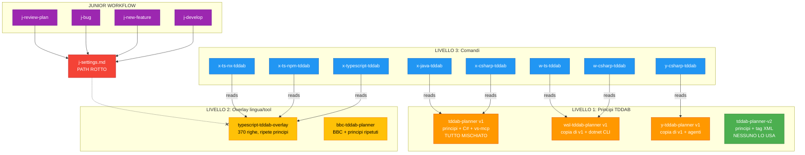
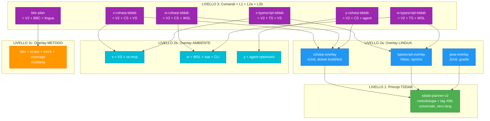

# TDDAB Dependencies

## Stato attuale

## Come dovrebbe essere

## Problemi

| Problema | Dettaglio |
|----------|-----------|
| Principi duplicati 3x | tddab-planner, wsl-tddab-planner, y-tddab-planner hanno gli stessi principi copia-incollati |
| Nessuna separazione | Principi, codice C#, comandi di verifica tutti nello stesso file |
| v2 isolato | tddab-planner-v2 esiste ma nessun loader/skill lo referenzia |
| Overlay ripete principi | typescript-tddab-overlay ripete le regole TDDAB invece di solo aggiungere il delta TS |
| j-settings rotto | Path punta a support/mind-sets/ che non esiste |
| 8 loader quasi identici | Solo 2-3 righe diverse tra loro, variano solo quale mindset leggono |
| allowed-tools spreco | Ogni loader ha 50+ tool nella lista, brucia token inutilmente |
| BBC non ha overlay | bbc-tddab-planner mescola principi+BBC+C#, ma BBC e multilang |
| Ambiente nei principi | x/w/y distingue solo l'ambiente (VS/WSL/agent) ma i file v1 mescolano ambiente dentro i principi |
